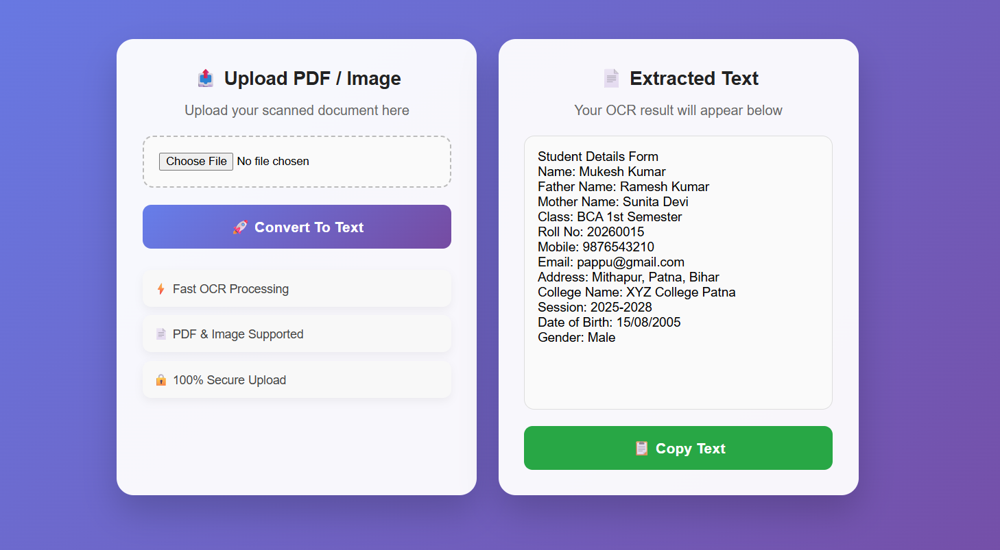
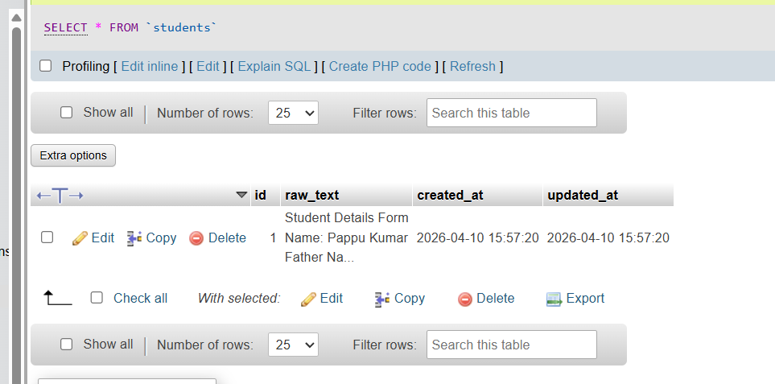

# 🚀 AI OCR Tool - Laravel Based Document Text Extractor

<p align="center">
  <strong>A Modern OCR Web Application Built with Laravel & OCR.Space API</strong><br>
  Upload scanned documents, images, or PDFs and instantly extract text using AI-powered OCR technology.
</p>

---

## 📸 Project Preview

### Application UI



### Database Storage Preview



---

## 📖 About The Project

AI OCR Tool is a smart document processing web application developed using **Laravel Framework** that allows users to upload scanned **PDFs or Images** and extract readable text instantly through **OCR.Space API**.

This project is designed for:

* Digital Form Processing
* Student Registration OCR
* Data Entry Automation
* Document Digitization
* AI Text Recognition Systems

---

## ✨ Core Features

* 📤 Upload PDF / JPG / JPEG / PNG Files
* 🤖 AI Powered OCR Text Extraction
* ⚡ Fast Processing Speed
* 📋 One Click Copy Extracted Text
* 🔒 Secure File Upload Validation
* 🎨 Modern Responsive UI Design
* 🛡️ Error Handling Support
* 💾 Database Storage Integration

---

## 🛠️ Built With

| Technology    | Purpose            |
| ------------- | ------------------ |
| Laravel 12    | Backend Framework  |
| PHP 8+        | Server Side Logic  |
| MySQL         | Database           |
| OCR.Space API | OCR Processing     |
| HTML5         | Frontend Structure |
| CSS3          | UI Styling         |
| JavaScript    | Interaction Logic  |

---

## 📂 Project Folder Structure

```bash
AI-OCR-PROJECT/
│
├── app/
│   ├── Http/
│   │   └── Controllers/
│   │       └── AIController.php
│   │
│   └── Models/
│       └── Student.php
│
├── database/
│   └── migrations/
│       └── create_students_table.php
│
├── resources/
│   └── views/
│       └── index.blade.php
│
├── screenshots/
│   ├── ai-ocr-project.png
│   └── database-preview.png
│
├── routes/
│   └── web.php
│
└── .env
```

---

## ⚙️ Installation Guide

### 1️⃣ Clone Repository

```bash
git clone https://github.com/pappu-kumar-sarkar/ai-ocr-project.git
cd ai-ocr-project
```

---

### 2️⃣ Install Composer Packages

```bash
composer install
```

---

### 3️⃣ Setup Environment File

```bash
cp .env.example .env
```

---

### 4️⃣ Generate Application Key

```bash
php artisan key:generate
```

---

### 5️⃣ Configure Database

Add your database credentials inside `.env` file:

```env
DB_CONNECTION=mysql
DB_HOST=127.0.0.1
DB_PORT=3306
DB_DATABASE=your_database
DB_USERNAME=root
DB_PASSWORD=
```

---

### 6️⃣ Add OCR API Key

```env
OCR_SPACE_API_KEY=your_api_key_here
```

---

### 7️⃣ Run Database Migration

```bash
php artisan migrate
```

---

### 8️⃣ Start Laravel Development Server

```bash
php artisan serve
```

Visit:

```arduino
http://127.0.0.1:8000
```

---

## 🔄 Application Workflow

```text
User Uploads File
      ↓
Laravel Validates File
      ↓
OCR.Space API Processes File
      ↓
Extracted Text Returned
      ↓
Saved Into Database
      ↓
Display Result in Textarea
```

---

## 🌍 OCR API Reference

**Service Provider:** OCR.Space
🔗 Website: https://ocr.space/

---

## 👨‍💻 Developer

**Pappu Kumar**
Laravel / PHP Developer

---

## 📌 Future Improvements

* PDF Download Extracted Text
* Export to Word/Excel
* Multi Language OCR
* AI Form Auto Fill Detection
* Drag & Drop Upload Feature

---

## 📜 License

Distributed under the MIT License.
Feel free to use and modify.

---

<p align="center">
  ⭐ If you like this project, don't forget to star the repository.
</p>
